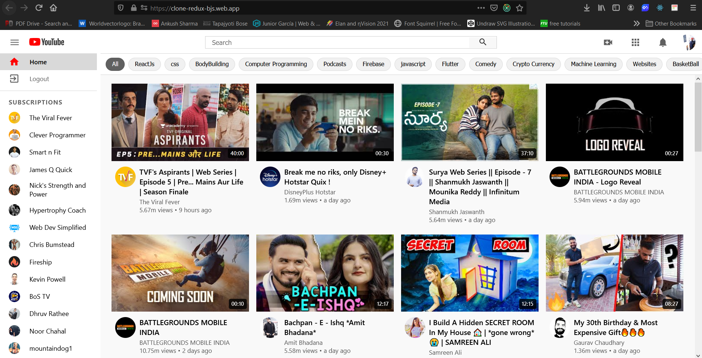

<br>
<div align="center">
  
</div>
<br>

<p 
align="center" 
style="font-size:2rem; letter-spacing: 4px;">
Using 
<br/> ReactJs, Sass, Firebase and YouTube API 
<br />
Fully Responsive
</p>

## Packages Used:
<ul>
 <li>react - Used as UI Library.</li>
 <li>redux - Used for the state management in the app.</li>
 <li>firebase - Used for the deployment.</li>
 <li>react-router-rom - Used as a routing library.</li>
 <li>material-ui - Used as icon library.</li>
 <li>axios - Used as Fetching library.</li>
 <li>numeral - Used for the easy number conversions.</li>
 <li>moment - Used for the time-ago functionality.</li>
 <li>react-loading-skeleton - Used as loading components.</li>
 <li>react-lazy-load-image-component - Used for the Lazy load images.</li>
</ul>

## API: 
Many features can be added to this project as it is not absolute. You can follow the *[documentation](https://developers.google.com/youtube/v3/docs)* for more data end-points.<br>
I have used some end-points like fetching:
 1. most-popular-videos
 2. video details
 3. channel details
 4. channel videos
 5. user's subscriptions and playlists
 6.  search query


## API Key:
Create a new project *[here](https://console.cloud.google.com/)* and  get the API key from dashboard/credential panel and paste in the *axios.js* in the *src/utils* folder.


## Preview of the Project: 

<div align="center">
  <h3>1. Home-Screen</h3>
  
</div>
<div align="center">
  <h3>2. Watch-Screen</h3>
  
</div>
<div align="center">
  <h3>3. Channel-Screen</h3>
  
</div>
<div align="center">
  <h3>4. Search-Screen</h3>
  
</div>

<br>
<br>

## Installation and set-up

1. Install all the dependencies
    ```
      npm install
     ```
2. Paste the YouTube API_KEY in the ***src/utils/axios.js*** file
  
3. Start the development server
    ```
   npm start
    ```

## Production Build

1. Generate the production build

   ```
   npm run build
   ``` 

```
If you like the work then don't forget to hit that ⭐ button to show some appreciation & love
for this project as your token of love does wonders.
```
